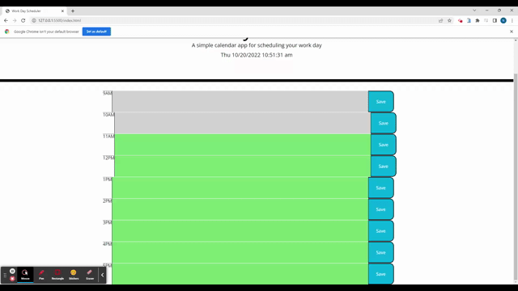

# Calender App
 

## Description 
  In this project you are able see a 9Am to 5PM day calender of the given day. You are able to save text inside of the text area to the local storage and each textarea box is color cordinate by the time of day. This project utilizes HTML, CSS, and JS.
    

    
## Table of Contents
  - [Installation](#installation)
  - [Usage](#usage)
  - [License](#license)
  - [Contributions](#contributions)
  - [Tests](#tests)
  - [Questions](#questions)
    
## Installation
  The only thing you'll need to do to install this application is to is clone down the repo to your computer. Or open the live github link to your browser. If you choose to clone this repo to your computer, you'll need to open the index.js file with live servers, from there you will be able to use the calenderapp.
    
    
## Usage
  
   
    
## Credits
Collaborators: Nicholas Webb
    
  
    
    
## License
 
Covered by N/A
    
  
    
  ## Contributions
    
  If you created an application of package and would like other development
    

    
  ## Questions
    You can contact me at:
    Gmail:Nicholaswebb2016@gmail.com
    Github:KingNick253
     